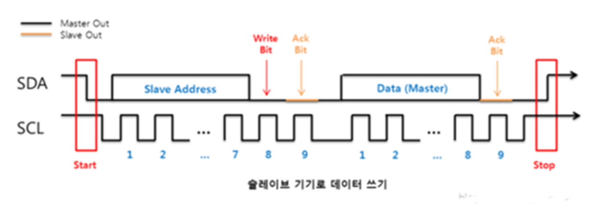
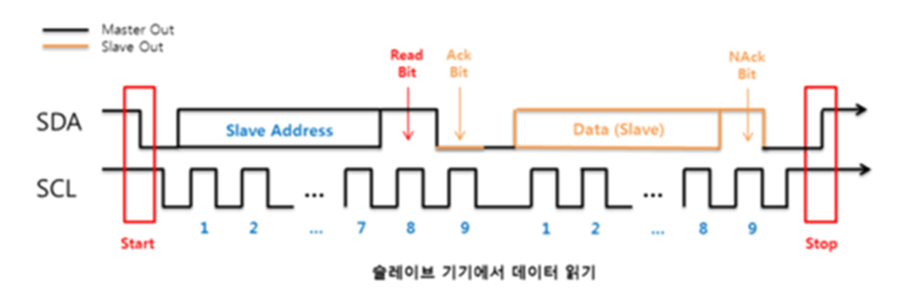

# \[AVR\] I2C 통신 개념 및 프로토콜 총정리

> 날짜: 2026-06-30
> 원본 노션: [링크](https://app.notion.com/p/AVR-I2C-38e1d46c18fc80ab93dae439a35effd4)

<!-- notion-page-id: 38e1d46c18fc80ab93dae439a35effd4 -->
<!-- notion-title: "[AVR] I2C 통신 개념 및 프로토콜 총정리" -->

---

<a id="notion-38f1d46c18fc8094a706c545ba9d290c"></a>

## 🌐 I2C (Inter-Integrated Circuit) 통신 총정리

> **💡 한 줄 요약**
>
> 단 \*\*2가닥의 선(SDA, SCL)\*\*으로 1개의 마스터(MCU)가 여러 개의 슬레이브(센서, RTC, 디스플레이 등) 장치들을 \*\*고유 주소(Address)\*\*를 이용해 제어하는 동기식 양방향 직렬 통신 규칙. (일명 '아이스퀘어씨')

<a id="notion-38f1d46c18fc802d8675df752e128b8a"></a>

### 1\. 하드웨어 핵심 구성 (딱 2선\!)

- <strong>SCL (Serial Clock)</strong>: 데이터 동기화를 위한 클록 신호선 (언제나 마스터가 째깍째깍 공급).
- <strong>SDA (Serial Data)</strong>: 실제 데이터가 오고 가는 양방향 데이터선.

> **⚠️ 필수 메모: 왜 풀업 저항(Pull-up Resistor)이 꼭 필요한가?**
>
> I2C에 연결된 장치들의 핀은 **오픈 드레인(Open-Drain)** 구조입니다. 즉, 핀에서 자체적으로 '0V(LOW)'는 만들 수 있지만 '5V나 3.3V(HIGH)' 전압은 스스로 밀어 올리지 못합니다. 따라서 선 중간에 풀업 저항을 달아 평소 상태를 HIGH로 유지해 주어야만 통신 쇼트 없이 안전하게 작동합니다.

<a id="notion-38f1d46c18fc80b08d7ad62557f3c61e"></a>

### 2\. 데이터 통신 흐름 (Data Frame)

I2C는 선이 하나(SDA)뿐이라 송신과 수신을 동시에 못 하는 **반이중(Half-Duplex) 통신**입니다. 대신 아래와 같은 정밀한 시나리오 약속에 따라 대화합니다.

```text
[START] ➡️ [Slave Address (7bit) + R/W (1bit)] ➡️ [ACK/NACK] ➡️ [Data Byte (8bit)] ➡️ [ACK/NACK] ➡️ [STOP]
```

1. **START 조건**: SCL이 HIGH일 때, SDA 라인이 먼저 LOW로 떨어지며 "나 이제 말 시작한다\!" 선언.
2. **슬레이브 주소 + R/W 전달**: 마스터가 깨우고 싶은 슬레이브의 고유 주소(7비트)와 읽을지(1)/쓸지(0) 결정하는 1비트를 합쳐 총 8비트를 쏨.
3. **ACK / NACK 판독**: 해당 주소를 가진 슬레이브가 응답으로 SDA 선을 LOW로 떨어뜨려 알림(**ACK**). 없으면 계속 HIGH(**NACK**).
4. **데이터 전송**: 8비트(1바이트)씩 데이터를 주고받음. 데이터를 받을 때마다 무조건 ACK 신호로 생사 확인을 함.
5. **STOP 조건**: SCL이 HIGH일 때, SDA 라인이 LOW에서 HIGH로 올라가며 "통신 끝\!" 선언 후 버스 해제.





Read(1)/Write(0), Ack(0)/NAck(1)

<a id="notion-38f1d46c18fc8097ac6ad3f3fe468ccf"></a>

### 3\. 통신 프로토콜 장단점 비교

|  |  |
| --- | --- |
| **장점 (Pros)** | **단점 (Cons)** |
| **선이 단 2개만 필요** (MCU 핀 절약 최고) | **속도가 다소 느림** (SPI 통신 대비 속도 한계) |
| 하나의 버스선에 **최대 127개** 장치 연결 가능 | 반이중(Half-Duplex)이라 **동시 송수신 불가능** |
| ACK(확인 응답) 기능이 있어 데이터 신뢰성 높음 | 하드웨어적으로 **풀업 저항 연산 및 설계** 필요 |
| 하드웨어 연결 구조가 매우 단순함 | 노이즈가 끼면 주소가 꼬여 버스가 먹통이 될 위험 있음 |

<a id="notion-38f1d46c18fc80169ffde165a77b720e"></a>

### 🏎️ 4. I2C 통신 속도 스펙 구분

- **Standard Mode**: 최대 100 kbps (가장 기본적이고 널리 쓰임)
- **Fast Mode**: 최대 400 kbps (센서류 데이터 긁어올 때 표준)
- **High-Speed Mode**: 최대 3.4 Mbps (초고속 제어용)
