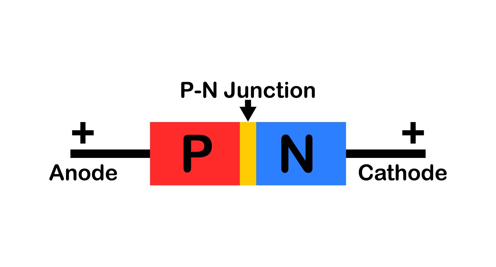

# \[STM32\] 능동 소자와 집적 회로

> 날짜: 2026-07-13
> 원본 노션: [링크](https://app.notion.com/p/STM32-39c1d46c18fc808d9b1cef5702a25312)

<!-- notion-page-id: 39c1d46c18fc808d9b1cef5702a25312 -->
<!-- notion-title: "[STM32] 능동 소자와 집적 회로" -->

---

# 🔌 수동소자 vs 능동소자

> **한 줄 요약**
>
> - **수동소자 (Passive):** 에너지를 소비/축적/방출만 하는 소자 (전력 증폭 X, 외부 전원 불필요)
> - **능동소자 (Active):** 에너지를 증폭하거나 제어하는 소자 (전력 증폭 O, 외부 전원 필요)

## 🌓 한눈에 보는 비교 (Table)

|  |  |  |
| --- | --- | --- |
| **구분** | **수동소자 (Passive Device)** | **능동소자 (Active Device)** |
| **핵심 역할** | 에너지 소비, 축적, 감쇄 | 에너지 증폭, 스위칭, 신호 제어 |
| **전력 증폭** | **불가능** (신호를 키울 수 없음) | **가능** (작은 신호로 큰 전력 제어) |
| **구동 조건** | 외부 전원(Vcc/GND) 없어도 작동함 | 반드시 외부 전원이 공급되어야 작동함 |
| **선형성** | 입력과 출력이 비례함 (선형적) | 입력과 출력이 비례하지 않음 (비선형적) |
| **대표 종류** | R (저항), L (인덕터), C (커패시터) | 트랜지스터(TR), FET, 다이오드, OP-Amp |

## 🔍 핵심 소자별 역할 요약

### 🔹 수동소자 (R-L-C)

- **R (Resistor, 저항):** 전류의 흐름을 방해하여 전류량을 조절하고 전압을 낮춤 (에너지 소비)
- **L (Inductor, 코일):** 전류의 변화를 막고, 에너지를 **자기장** 형태로 축적 (정화, 단위 헨리)
- **C (Capacitor, 콘덴서):** 전압의 변화를 막고, 에너지를 **전기장** 형태로 축적 (전원 안정, 단위 패럿)

### 🔸 능동소자 (Active)

- **Diode (다이오드):** 전류를 한쪽 방향으로만 흐르게 제어 (정류 작용)
- **Transistor / FET:** 작은 전류/전압으로 큰 전류를 켜고 끄거나(스위칭), 신호를 키움(증폭)
- **OP-Amp (연산증폭기):** 아날로그 신호를 정밀하게 증폭하고 연산함

## 💡 임베디드 개발자 시선의 팁

- STM32 회로를 설계할 때 수동소자(R, C)는 주로 전원단의 노이즈를 잡는 디커플링 커패시터나, GPIO 핀의 풀업/풀다운 저항으로 많이 쓰입니다.
- MCU의 GPIO 핀은 내보낼 수 있는 전류가 매우 약하므로, 모터나 고전력 LED 같은 **능동소자** 부하를 제어할 때는 반드시 트랜지스터(TR)나 FET 같은 다른 능동소자를 거쳐서 제어해야 칩이 타버리지 않습니다.

# 📐 다이오드 (Diode)

> **한 줄 요약**
>
> 전류를 \*\*한쪽 방향(순방향)\*\*으로만 흐르게 하고, 반대 방향(역방향)으로는 흐르지 못하게 막는 **'전류의 일방통행 표지판'** 역할을 하는 능동소자입니다.

## 🌓 기본 구조 및 원리

다이오드는 P형 반도체와 N형 반도체를 접합하여 만듭니다. 전류가 흐르는 방향에 따라 기호와 명칭이 정해집니다.

- **애노드 (Anode, A):** `+` 극성 / 전류가 들어오는 곳
- **캐소드 (Cathode, K):**  극성 / 전류가 나가는 곳 (실물 소자에는 띠가 그려진 부분)
- **순방향 바이어스:** 애노드에 `+`, 캐소드에  전압을 걸면 전류가 흐름.
- **역방향 바이어스:** 애노드에 , 캐소드에 `+` 전압을 걸면 전류가 차단됨.

# 🧮 \[회로 계산\] LED 직렬 저항 구하기

> **핵심 공식 (옴의 법칙)**
>
> 저항 (R) = 전압 (V) / 전류 (I)
>
> - V : 공급 전압 (회로 전원)
> - I : 목표 전류 -&gt; **10mA (0.01A)**

## 💡 전원별 계산 결과

### ① STM32 GPIO 핀 직접 제어 시 (**3.3V 전원**)

- **공식 대입:** R = 3.3V / 0.01A = 3.3V / 0.01A = 330 Omega

> 부하가 직렬로 연결되면 전류는 같고 전압은 분배된다. → 전압 분배의 법칙 부하가 병렬로 연결되면 전압은 같고 전류는 분배된다. → 전류 분배의 법칙

# 📝 \[문제 풀이\] 전압 분배 및 전류 분배 법칙

---

## 🔗 PART 1. 전압 분배의 법칙 문제

- 핵심 공식:

  - 전체 저항(R) = R1 + R2
  - 전체 전류(I) = V / 전체 저항(R)
  - 각 저항에 걸리는 전압 = 전류 \* 저항

### 1번 문제

- 조건: V = 5V, R1 = 100 옴, R2 = 100 옴
- 풀이:

  - 전체 저항 = 100 + 100 = 200 옴
  - 흐르는 전류: 5V / 200 옴 = 0.025A = 25mA
  - R1 양단 전압: 0.025A \* 100 옴 = 2.5V
  - R2 양단 전압: 0.025A \* 100 옴 = 2.5V

### 2번 문제

- 조건: V = 5V, R1 = 100 옴, R2 = 200 옴
- 풀이:

  - 전체 저항 = 100 + 200 = 300 옴
  - 흐르는 전류: 5V / 300 옴 = 0.0167A = 16.67mA
  - R1 양단 전압: 5V \* (100 / 300) = 1.67V
  - R2 양단 전압: 5V \* (200 / 300) = 3.33V

### 3번 문제 (출력 전압 Vout 구하기)

- 조건: V = 5V, R1 = 200 옴, R2 = 100 옴
- 풀이: Vout은 그라운드(GND) 기준으로 R2에 걸리는 전압과 같습니다.

  - Vout 계산: 5V \* (100 / (200 + 100)) = 1.67V
  - 흐르는 전류: 5V / 300 옴 = 16.67mA

> 💡 하단 말풍선 퀴즈 정답: 저항이 큰 쪽이 전압이 \[ 크게 \] 걸린다\!

---

## 🔀 PART 2. 전류 분배의 법칙 문제

- 핵심 공식:

  - 소비전력(P) = 전압 \* 전류 = 전류^2 \* 저항

### 1번 문제

- 구조: R1(100 옴) 직렬 + R2, R3, R4(각 300 옴) 병렬
- 풀이:

  1. 병렬 구간 합성 저항: 300 옴 / 3 = 100 옴
  2. 전체 저항: 100 + 100 = 200 옴
  3. 전체 전류: 5V / 200 옴 = 25mA
  4. 구간 전압: R1에 2.5V가 걸리고, 병렬 구간(R2, R3, R4)에 공통으로 2.5V가 걸림.
- 최종 정답:

  - R1: 전류 = 25mA / 소비전력 = 2.5V \* 0.025A = 62.5mW
  - R2, R3, R4 (동일): 전류 = 2.5V / 300 옴 = 8.33mA / 소비전력 = 2.5V \* 0.00833A = 20.83mW

### 2번 문제

- 구조: R1(100 옴) 직렬 + R2(100 옴), R3(200 옴), R4(400 옴) 병렬
- 풀이:

  1. 병렬 구간 합성 저항: 약 57.14 옴
  2. 전체 저항: 100 + 57.14 = 157.14 옴
  3. 전체 전류: 5V / 157.14 옴 = 31.82mA
  4. 구간 전압: R1에 3.18V, 병렬 구간에 공통으로 1.82V가 걸림.
- 최종 정답:

  - R1: 전류 = 31.82mA / 소비전력 = 3.18V \* 0.0318A = 101.12mW
  - R2: 전류 = 1.82V / 100 옴 = 18.2mA / 소비전력 = 1.82V \* 0.0182A = 33.12mW
  - R3: 전류 = 1.82V / 200 옴 = 9.1mA / 소비전력 = 1.82V \* 0.0091A = 16.56mW
  - R4: 전류 = 1.82V / 400 옴 = 4.55mA / 소비전력 = 1.82V \* 0.00455A = 8.28mW

> 💡 하단 말풍선 퀴즈 정답: 저항이 작은 쪽이 전류가 많이 흐른다\!

# 🔌 트랜지스터 (Transistor) &amp; H-Bridge

> **한 줄 요약**
>
> 작은 전류(Base)를 이용해 큰 전류(Collector-Emitter)를 제어하는 능동소자로, 임베디드 회로에서는 주로 '전자식 스위치' 역할을 합니다.

## 🌓 1. 트랜지스터 기본 분류 및 작동 원리

### 🔹 NPN 트랜지스터 (가장 많이 사용)

- **전류 방향:** Collector -&gt; Base -&gt; Emitter (- 전원 제어)
- **제어 신호:** Base에 1(High, 전류 공급)을 주면 스위치 ON / 0(Low, 전류 차단)을 주면 스위치 OFF
- **실무 활용:** STM32 GPIO 핀으로 LED나 모터의 그라운드(GND) 쪽 라인을 끊었다 연결했다 할 때 씁니다.

### 🔸 PNP 트랜지스터

- **전류 방향:** Emitter -&gt; Base -&gt; Collector (+ 전원 제어)
- **제어 신호:** Base에 0(Low, 전류가 빠져나감)을 주면 스위치 ON / 1(High)을 주면 스위치 OFF
- **실무 활용:** 회로의 +전원(VCC) 공급 라인 자체를 켜고 끌 때 사용합니다.

# ⚡ FET (전장효과 트랜지스터)

> **한 줄 요약**
>
> 일반 트랜지스터(BJT)가 \*\*'전류'\*\*로 전류를 켜고 끄는 스위치라면, FET는 \*\*'전압'\*\*으로 전류를 켜고 끄는 스위치입니다. 현대 임베디드 디지털 회로(MCU 내부 포함)는 대부분 이 FET를 사용합니다.

## 🌓 일반 TR(BJT) vs FET 핵심 비교

|  |  |  |
| --- | --- | --- |
| **구분** | **일반 트랜지스터 (BJT)** | **FET (특히 MOSFET)** |
| **제어 방식** | **전류** 제어 (Base에 전류를 흘려줘야 켜짐) | **전압** 제어 (Gate에 전압만 걸어주면 켜짐) |
| **핀 명칭** | 베이스(B) - 컬렉터(C) - 에미터(E) | 게이트(G) - 드레인(D) - 소스(S) |
| **매칭 구조** | NPN / PNP | N-Channel / P-Channel |
| **전력 소모** | 스위치를 켜고 있는 동안 지속해서 전류가 소모됨 | 켤 때 전압만 걸면 전류가 거의 안 흐름 (초절전) |
| **ON 저항** | 켜졌을 때 일정한 전압(약 0.2V)이 무조건 깎임 | 전압 대신 \*\*미세한 ON 저항(R\_DS(on))\*\*이 존재함 |
| **주요 용도** | 소전류 스위칭, 아날로그 증폭 회로 | 고속 스위칭, 고전류(모터) 제어, MCU 내부 소자 |

## 🛠️ 임베디드 개발자 시선의 FET 특징

- **STM32와 최고의 궁합:**

  STM32의 GPIO 핀은 내보낼 수 있는 전류가 매우 약합니다. 일반 TR은 켜기 위해 전류를 계속 줘야 해서 부담스럽지만, FET는 **전압(3.3V)만 툭 걸어주면 전류를 거의 먹지 않고도 켜지기 때문에** MCU 핀에 직접 연결해서 쓰기 아주 좋습니다.
- **N-Ch이 대세:**

  일반 TR에서 NPN을 가장 많이 쓰듯, FET도 스위칭 속도가 빠르고 가격이 저렴한 **N-Channel MOSFET**을 가장 흔하게 사용합니다. (Gate에 High를 주면 ON)

# 🔢 디지털(Digital)과 논리 게이트(Logic Gate)

> **한 줄 요약**
>
> - **디지털:** 연속적인 아날로그 신호를 0과 1(전압이 없다/있다)이라는 2가지 상태로 단순화한 것.
> - **논리 게이트:** 이 0과 1의 신호들을 조합하여 연산(AND, OR, NOT 등)을 수행하는 하드웨어 기본 회로 단위.

## 🌓 1. 디지털 신호의 특징

- **0과 1의 정체:** 임베디드 회로(STM32)에서 0(Low)은 대략 0V(GND)를 의미하고, 1(High)은 3.3V(VCC) 전압이 걸린 상태를 의미합니다.
- **노이즈에 강함:** 아날로그 신호는 약간의 노이즈만 껴도 값이 왜곡되지만, 디지털은 2.5V든 3.3V든 전부 '1'로 인식하기 때문에 신호 왜곡과 노이즈에 매우 강합니다.

## 🎛️ 2. 필수 논리 게이트 7가지 한눈에 보기

각 게이트의 이름, 동작 규칙, 진리표(입출력 관계) 요약입니다.

### ① NOT 게이트 (반전기 / Inverter)

- **규칙:** 청개구리 게이트. 입력을 그대로 뒤집어서 출력함.
- **진리표:**

  - 입력 0 -&gt; 출력 1
  - 입력 1 -&gt; 출력 0

### ② AND 게이트 (논리곱)

- **규칙:** 깐깐한 게이트. **모든 입력이 1일 때만** 출력이 1이 됨.
- **진리표:**

  - 0, 0 -&gt; 0
  - 0, 1 -&gt; 0
  - 1, 0 -&gt; 0
  - 1, 1 -&gt; 1

### ③ OR 게이트 (논리합)

- **규칙:** 너그러운 게이트. 입력 중 **하나라도 1이 있으면** 출력이 1이 됨.
- **진리표:**

  - 0, 0 -&gt; 0
  - 0, 1 -&gt; 1
  - 1, 0 -&gt; 1
  - 1, 1 -&gt; 1

### ④ NAND 게이트 (AND + NOT)

- **규칙:** AND 결과를 완전히 뒤집은 것. 모두 1일 때만 0이 됨.
- **진리표:**

  - 0, 0 -&gt; 1
  - 0, 1 -&gt; 1
  - 1, 0 -&gt; 1
  - 1, 1 -&gt; 0

### ⑤ NOR 게이트 (OR + NOT)

- **규칙:** OR 결과를 완전히 뒤집은 것. 모두 0일 때만 1이 됨.
- **진리표:**

  - 0, 0 -&gt; 1
  - 0, 1 -&gt; 0
  - 1, 0 -&gt; 0
  - 1, 1 -&gt; 0

### ⑥ XOR 게이트 (배타적 OR - 매우 중요\!)

- **규칙:** 서로 '다를 때'만 저격하는 게이트. **두 입력이 서로 다르면 1**, 같으면 0을 출력함.
- **진리표:**

  - 0, 0 -&gt; 0
  - 0, 1 -&gt; 1
  - 1, 0 -&gt; 1
  - 1, 1 -&gt; 0

### ⑦ XNOR 게이트 (XOR + NOT)

- **규칙:** 두 입력이 **서로 같으면 1**, 다르면 0을 출력함.
- **진리표:**

  - 0, 0 -&gt; 1
  - 0, 1 -&gt; 0
  - 1, 0 -&gt; 0
  - 1, 1 -&gt; 1

## 🛠️ 임베디드 개발자 실무 Tip

- **소프트웨어 비트 연산과의 매칭:**

  C언어로 코딩할 때 쓰는 비트 연산자들과 완벽히 1대1 매칭됩니다.

  - AND 게이트 = `&` 연산자 (특정 비트를 0으로 클리어할 때 사용)
  - OR 게이트 = `|` 연산자 (특정 비트를 1로 세팅할 때 사용)
  - XOR 게이트 = `^` 연산자 (특정 비트의 상태를 반전/토글할 때 사용)
  - NOT 게이트 = `~` 연산자 (전체 비트 반전)
- **MCU 내부는 게이트 덩어리:**

  우리가 공부하는 STM32 M4 칩 내부에는 이 논리 게이트(정확히는 트랜지스터/FET 조합으로 만든 게이트)가 수억 개씩 들어차 있어서 덧셈, 뺄셈, 타이머 세팅 등의 복잡한 계산을 초고속으로 처리하는 것입니다.
- Gate는 CMOS 방식이 대세다.

 
