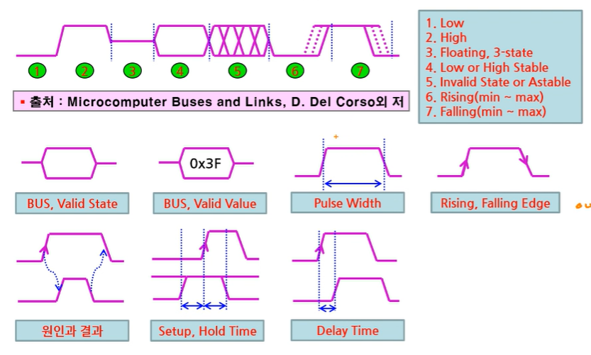

# \[STM32\] 메모리와 Timing Chart

> 날짜: 2026-07-13
> 원본 노션: [링크](https://app.notion.com/p/STM32-Timing-Chart-39c1d46c18fc80fdbeb9f81ed3c1377a)

<!-- notion-page-id: 39c1d46c18fc80fdbeb9f81ed3c1377a -->
<!-- notion-title: "[STM32] 메모리와 Timing Chart" -->

---

# 💾 \[메모리 계산\] 주소선과 메모리 주소 범위 구하기

## 🌓 \[기본 분석 검토\]

- **주소선 수:** A0 \~ A14 = 총 15개 (2의 15제곱 = 32,768개의 주소 지정 가능)
- **데이터 비트 수:** I/O0 \~ I/O7 = 8비트 (1바이트 단위로 저장됨)
- **용량 계산:** 2의 15제곱 바이트 = 32,768 바이트 = **32 KiB**

  - 계산 팁: 2의 15제곱 = 2의 5제곱 \* 2의 10제곱 = 32 \* 1KiB = 32KiB

## 🔍 문제 1. CPU 0x0번지에 연결된다면 마지막 주소는?

- **정답:** **0x7FFF**
- **풀이 이유:**

  - 32 KiB는 10진수로 총 32,768개의 방이 있습니다.
  - 컴퓨터는 주소를 **0번부터** 세기 때문에, 마지막 주소의 번호는 \[총 개수 - 1\]인 **32,767번지**가 됩니다.
  - 32,767을 16진수로 변환하면 **0x7FFF**가 됩니다.
  - 주소 범위: **0x0000 \~ 0x7FFF**

## 🔍 문제 2. 주소가 0x1000 번지부터 시작한다면 마지막 주소는?

- **정답:** **0x8FFF**
- **풀이 이유:**

  - 시작 주소가 0x0이 아니라 0x1000으로 시프트(Shift)된 상황입니다.
  - 공식: **\[시작 주소\] + \[메모리 크기 - 1\] = 마지막 주소**
  - 계산: 0x1000 + 0x7FFF = **0x8FFF**
  - 주소 범위: **0x1000 \~ 0x8FFF**

## 🔍 문제 3. 0x1000 번지 메모리 뒤에 또 하나(똑같은 32KiB)를 추가한다면 주소 범위는?

- **정답:** **0x9000 \~ 0x10FFF**
- **풀이 이유:**

  - 첫 번째 메모리가 0x1000에서 시작해서 **0x8FFF**에서 끝났습니다.
  - 두 번째 메모리는 그 바로 다음 번지인 **0x9000**부터 시작해야 주소가 안 겹치고 연속되게 배치됩니다. (0x8FFF 다음은 0x9000입니다.)
  - 시작 주소인 0x9000에다가 똑같이 메모리 크기(0x7FFF)를 더해줍니다.
  - 계산: 0x9000 + 0x7FFF = **0x10FFF**
  - 두 번째 메모리의 주소 범위: **0x9000 \~ 0x10FFF**

### 💡 임베디드 핵심 팁 (16진수 쉽게 더하기)

16진수에서 `F`에 `1`을 더하면 자릿수가 올라갑니다.

- 0x8FFF + 1 = **0x9000**
- 0x7FFF + 1 = **0x8000** (즉, 32KiB 크기 자체를 16진수로 나타내면 0x8000입니다.)

따라서 문제 3번을 풀 때 `첫 번째 메모리 시작(0x1000) + 크기(0x8000) = 두 번째 메모리 시작(0x9000)`으로 계산하면 손쉽게 범위를 찾을 수 있습니다.

# 💾 \[메모리 계산\] 64바이트 메모리 범위와 정렬(Alignment)

## 🔍 문제 1. 64바이트 메모리는 0x0번지부터 몇 번지까지 일까?

- **정답:** **0x3F 번지까지**
- **풀이 이유:**

  - 컴퓨터는 주소를 0부터 세므로, 64바이트 크기라면 마지막 주소는 \[총 개수 - 1\]인 **63번지**가 됩니다.
  - 10진수 63을 16진수로 바꾸면 **0x3F**가 됩니다.
  - 주소 범위: **0x00 \~ 0x3F** (총 64개 방)

## 🔍 문제 2. 64바이트 Align된 주소는 어떤 주소들이 항상 0이어야 할까?

- **정답:** 이진수로 표현했을 때 **하위 6개 비트(A5 \~ A0)가 항상 0**이어야 합니다. (16진수 주소 기준으로는 **맨 끝자리가 0, 4, 8, C로 끝나야 함**)
- **풀이 이유:**

  - '64바이트 정렬(Align)'이란, 주소 번지가 **64의 배수**(0, 64, 128, 192...)가 되는 곳에서만 데이터가 시작할 수 있다는 규칙입니다.
  - 64의 배수들을 2진수로 변환해 보면 명확한 규칙이 보입니다.

### 💡 2진수로 보는 규칙 (하위 6비트 확인)

- 0 (10진수) = `0000 0000 0000` (2진수)
- 64 (10진수) = `0000 0100 0000` (2진수) -&gt; 2의 6제곱 자리만 1
- 128 (10진수) = `0000 1000 0000` (2진수)
- 192 (10진수) = `0000 1100 0000` (2진수)

위의 2진수 값들을 보면, 64의 배수 주소들은 뒷부분의 **하위 6개 비트(2의 0제곱부터 2의 5제곱까지인 1, 2, 4, 8, 16, 32를 나타내는 자리)가 무조건 0**으로 끝납니다. 이 하위 6비트가 조금이라도 1을 가지면 64의 배수가 될 수 없습니다.

### 🛠️ 암기 팁 (N바이트 Align 법칙)

임베디드에서 어떤 바이트 정렬이든 이 규칙을 따릅니다.

- **4바이트 Align (32비트 컴퓨터 기본):** 4 = 2의 2제곱이므로, **하위 2개 비트**가 0이어야 함. (주소 끝자리가 0, 4, 8, C)
- **8바이트 Align:** 8 = 2의 3제곱이므로, **하위 3개 비트**가 0이어야 함. (주소 끝자리가 0, 8)
- **64바이트 Align:** 64 = 2의 6제곱이므로, **하위 6개 비트**가 0이어야 함.

# ⏱️ 타이밍 차트 기호 및 용어 총정리

## 🌓 1. 기본 신호 파형의 7가지 상태 (상단 그림)

- **1\. Low:** 전압이 낮은 안정적인 상태 (논리 0).
- **2\. High:** 전압이 높은 안정적인 상태 (논리 1).
- **3\. Floating, 3-state:** 하이 임피던스(High-Z) 상태. 회로가 끊긴 것처럼 0도 1도 아닌 중간에 붕 떠 있는 상태입니다.
- **4\. Low or High Stable:** 데이터 버스(BUS) 등에 여러 가닥의 신호가 0 또는 1로 안정적으로 정해져서 흐르고 있는 상태입니다.
- **5\. Invalid State or Astable:** 신호가 마구 흔들리거나(과도기), 어떤 값인지 정의할 수 없어 무시해야 하는 불안정한 상태입니다.
- **6\. Rising (min \~ max):** 신호가 Low에서 High로 올라가는 상승 구간입니다. 점선은 부품의 특성이나 환경에 따라 가장 빠를 때(min)와 가장 느릴 때(max)의 오차 범위를 나타냅니다.
- **7\. Falling (min \~ max):** 신호가 High에서 Low로 내려가는 하강 구간입니다. 마찬가지로 점선으로 최소\~최대 전송 지연 오차 범위를 표현합니다.

## 📊 2. 버스 및 펄스 관련 기본 용어 (중간 그림)

- **BUS, Valid State (버스 유효 상태):** 여러 개의 데이터선(예: 8비트, 16비트 버스)에 의미 있는 데이터 신호가 채워져 있는 구간입니다.
- **BUS, Valid Value (버스 유효 값):** 데이터 버스에 실린 실제 구체적인 데이터 값(예: 16진수 0x3F)이 확정되어 명시된 상태입니다.
- **Pulse Width (펄스 폭):** 하나의 펄스(신호)가 High 또는 Low 상태를 유지하는 순수한 시간적 두께(길이)를 뜻합니다.
- **Rising, Falling Edge (상승/하강 에지):** 신호가 변하는 순간을 화살표 표시 모양으로 직관적으로 나타낸 것입니다.

## 🛠️ 3. 타이밍 차트 해석의 핵심 고급 용어 (하단 그림)

임베디드 프로그래밍과 디버깅 시 가장 유심히 봐야 하는 핵심 제어 규칙들입니다.

- **원인과 결과 (Causality):**

  - 어떤 신호가 변함으로 인해 다른 신호가 변하게 되는 '인과관계'를 점선 화살표로 연결해 둔 것입니다.
  - 예: "MCU가 클럭을 떨어뜨리니까(원인), 센서가 데이터를 내보낸다(결과)."
- **Setup, Hold Time (셋업 타임 / 홀드 타임 - 매우 중요):**

  - **Setup Time (설정 시간):** 클럭 신호(에지)가 뛰기 **전**에, 데이터 신호가 미리 안정적으로 도착해서 대기해야 하는 최소한의 시간입니다.
  - **Hold Time (유지 시간):** 클럭 신호가 뛴 **후**에도, 데이터를 안전하게 읽을 수 있도록 데이터 신호가 무너지지 않고 유지되어야 하는 최소한의 시간입니다.
  - *팁:* 이 두 시간 규칙을 어기면 데이터가 깨지는 '메타스태빌리티(Metastability)' 현상이 발생합니다.
- **Delay Time (지연 시간):**

  - 원인이 되는 신호가 바뀐 순간부터 결과 신호가 실제로 바뀔 때까지 걸리는 **하드웨어적인 물리적 지연 시간**입니다.
  - 반도체 내부의 저항과 커패시터 성분 때문에 빛의 속도로 바로 변하지 못하고 미세한 시간 차이가 발생하게 됩니다.

## 💡 임베디드 실무 활용 포인트

나중에 STM32로 SPI나 I2C 통신 코드를 짤 때 이 그림을 떠올리시면 좋습니다. 만약 통신 속도를 너무 빠르게 올리면 **Setup/Hold Time**을 충족하지 못해 통신 에러가 나기 시작합니다. 이때 데이터시트의 이 차트를 보고 `Delay`나 `Pulse Width` 한계 수치를 확인한 뒤, STM32 레지스터나 큐브IDE 설정을 통해 통신 속도 클럭을 낮춰주어야 문제를 해결할 수 있습니다.

# 🧠 \[메모리 제어\] CPU의 메모리 읽기, 쓰기 Timing &amp; 핵심 탐구

## 🌓 1. 신호선의 이름과 의미 사전

타이밍 차트를 보기 전, 각 기호 앞의 slash(`/`) 표시는 'Active Low(0일 때 동작함)'를 의미합니다.

- **A\[n:0\]:** Address Bus (주소 버스). 데이터를 읽거나 쓸 메모리의 '방 번호'를 지정합니다.
- **D\[n:0\]:** Data Bus (데이터 버스). 실제 주고받는 '알맹이 데이터'가 실립니다.
- /CS: Chip Select (칩 선택). 여러 메모리 중 이 메모리 칩을 깨워 사용할 때 0으로 떨어뜨립니다.
- /WR: Write Enable (쓰기 신호). 이 신호가 0으로 떨어졌다 올라가는 순간 데이터를 메모리에 씁니다.
- /RD: Read Enable (읽기 신호). 이 신호가 0으로 떨어져 있는 동안 메모리가 데이터를 밖으로 출력합니다.

## 📊 2. 타이밍 차트 흐름 해독 (동작 순서)

### 🔹 Memory Write (메모리에 데이터 쓰기)

1. CPU가 주소 버스(A)에 목표 주소를 뿌리고, 데이터 버스(D)에 쓸 데이터를 미리 올려둡니다.
2. 타겟 메모리를 선택하기 위해 /CS 신호를 0(Low)으로 떨어뜨립니다.
3. 준비가 끝나면 **/WR 신호를 0(Low)으로 떨어뜨렸다가 1(High)로 다시 올립니다.**
4. **핵심 시점:** 바로 이 **/WR 신호가 다시 올라가는(Rising Edge) 순간**에 데이터 버스의 값이 메모리에 콕 박혀서 저장(Write)됩니다.

### 🔸 Memory Read (메모리에서 데이터 읽기)

1. CPU가 읽고 싶은 방 번호를 주소 버스(A)에 뿌립니다.
2. /CS 신호를 0(Low)으로 떨어뜨려 칩을 선택합니다.
3. /RD 신호를 0(Low)으로 떨어뜨려 메모리에게 "데이터를 밖으로 내보내라"고 명령합니다.
4. 메모리 칩이 내부에서 데이터를 찾아 데이터 버스(D)에 올려놓을 때까지 미세한 지연 시간(Delay)이 걸립니다.
5. **핵심 시점:** 데이터가 안정화되면, **/RD 신호가 다시 1(High)로 올라가는 순간**에 CPU가 데이터 버스에 있는 값을 휙 채가며 읽기(Read)가 완료됩니다.

## 🛠️ 3. 슬기로운 탐구 생활 문제 풀이 (면접 단골 질문)

### ❓ 질문 1. 만약 CPU가 매우 빠른데 메모리가 느린 경우, 위 타이밍을 그대로 이용하면 어떤 문제가 발생할까?

- **정답:** **데이터 오염 및 읽기/쓰기 실패 (정상적인 데이터 처리 불가능)**
- **상세 설명:** CPU가 속도가 너무 빠르면, 느린 메모리가 데이터를 채 준비하기도 전에 제어 신호(/WR, /RD)를 올려버립니다. 읽기 작업 시에는 메모리가 데이터 버스에 값을 채 올리기 전에 읽어버려서 엉뚱한 쓰레기 값을 읽게 되고, 쓰기 작업 시에는 메모리가 저장하기도 전에 주소와 데이터 신호가 사라져 버려 저장이 실패합니다.
- **해결책:** 이를 해결하기 위해 CPU가 메모리에게 시간을 조금 더 벌어주는 웨이트 스테이트(Wait State)를 삽입하거나, 하드웨어적인 **READY(또는 WAIT) 신호선**을 추가해 메모리가 준비될 때까지 CPU를 잠깐 대기하게 만듭니다.

### ❓ 질문 2. 주변장치 안에 있는 Register를 CPU가 Access하려면 어떻게 접근할 수 있을까?

- **정답:** **주변장치의 레지스터를 '메모리의 일부분(특정 주소)'으로 맵핑하여 접근합니다.**
- **상세 설명:** 이것을 MMIO (Memory-Mapped I/O)라고 부르며, STM32(ARM Cortex-M)를 포함한 대부분의 현대 MCU가 채택한 방식입니다. 예를 들어 STM32에서 GPIOA 배출 레지스터가 `0x40020014` 번지라는 고유의 주소를 가집니다. CPU 입장에서는 포인터 변수로 이 주소에 데이터를 읽고 쓰면, 메모리가 아니라 실제 타이머나 GPIO 같은 주변장치 하드웨어가 직접 제어됩니다.

### ❓ 질문 3. CPU 입장에서 CPU 내부의 Register와 주변장치 안에 있는 Register의 차이는 무엇일까?

- **정답:** **접근 속도(클럭 속도)와 연결된 버스(Bus)의 위치가 다릅니다.**

|  |  |  |
| --- | --- | --- |
| **구분** | **CPU 내부 Register (예: R0\~R15 등)** | **주변장치 내부 Register (예: GPIO, Timer 등)** |
| **위치** | CPU 코어(Core) 내부 바로 옆 | CPU 코어 외부의 주변장치(Peripheral) 영역 |
| **속도** | <strong>초고속 (1클럭 소요)</strong>, 지연 시간이 전혀 없음 | <strong>비교적 느림 (수 클럭 소요)</strong>, 버스를 거쳐야 함 |
| **접근 방식** | 전용 어셈블리 명령어(MOV, ADD 등)로 직접 제어 | 메모리 주소(MMIO)를 통해 간접적으로 읽고 씀 |
| **용도** | 임시 연산 결과 저장, 프로그램 카운터(PC) 등 | 하드웨어 기능 설정, 센서 데이터 전송 및 제어 |
